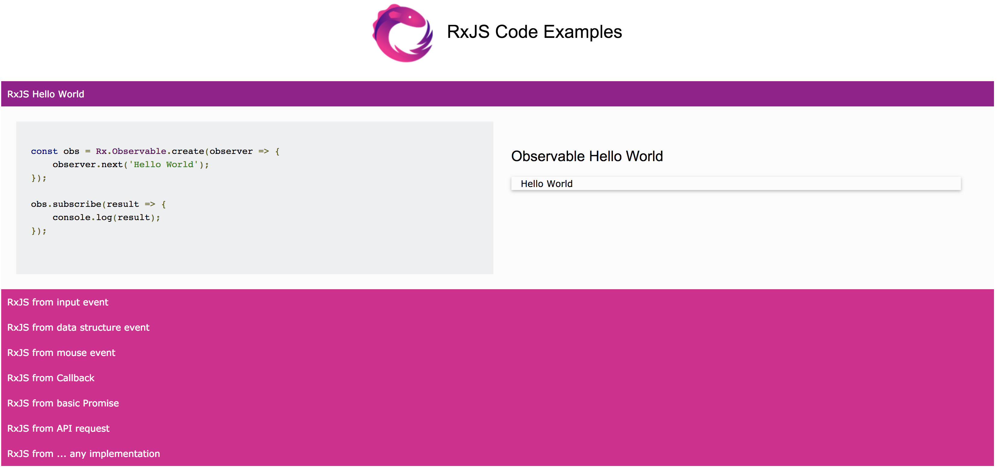

# RXJS 101

This is a base project to practice RxJS. The idea is use some RxJS operators to understand how it works. 

Available examples:

- Hello World 
- From Input Event
- From Data Structure
- From Mouse Event
- From Callback
- From Promise 
- From API
- How to build a RxJS accordion 

### How it looks: 

## Motivation

The main motivation behind this project is try to understand this new and trendy topic.

## Contribution

PRs are welcome, you can add any example you want (or improve a current one)
